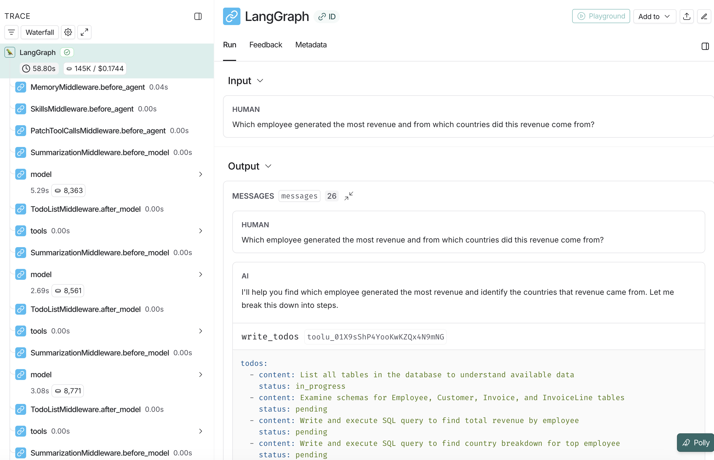

# Text-to-SQL Deep Agent

A natural language to SQL query agent powered by **Deep Agents 0.7.8** and a choice of Anthropic, OpenAI, Kimi, GLM, DeepSeek, Gemini, Qwen, or Grok models. This version uses the lean 0.7 prompt stack and an explicit read-only built-in tool policy.

## What is Deep Agents?

Deep Agents is a sophisticated agent framework built on LangGraph that provides:

- **Lean prompts** - Avoid duplicated built-in tool instructions
- **Filesystem backend** - Load memory and skills without exposing write tools
- **Subagent spawning** - Delegate specialized tasks to focused agents
- **Context management** - Prevent context window overflow on complex tasks

## Demo Database

Uses the [Chinook database](https://github.com/lerocha/chinook-database) - a sample database representing a digital media store.

## Quick Start

### Prerequisites

- Python 3.11 or higher
- An API key for at least one supported model provider
- (Optional) LangSmith API key for tracing ([sign up here](https://smith.langchain.com/))

### Installation

1. Clone the deepagents repository and navigate to this example:

```bash
git clone https://github.com/langchain-ai/deepagents.git
cd deepagents/examples/text-to-sql-agent-0.7
```

1. Download the Chinook database:

```bash
# Download the SQLite database file
curl -L -o chinook.db https://github.com/lerocha/chinook-database/raw/master/ChinookDatabase/DataSources/Chinook_Sqlite.sqlite
```

1. Create a virtual environment and install dependencies:

```bash
# Using uv (recommended)
uv sync
source .venv/bin/activate  # On Windows: .venv\Scripts\activate
```

1. Set up your environment variables:

```bash
cp .env.example .env
# Edit .env and add your API keys
```

Set the key for the provider you plan to use in `.env`:

```
ANTHROPIC_API_KEY=your_anthropic_api_key_here
OPENAI_API_KEY=your_openai_api_key_here
MOONSHOT_API_KEY=your_kimi_api_key_here
ZAI_API_KEY=your_glm_api_key_here
DEEPSEEK_API_KEY=your_deepseek_api_key_here
GEMINI_API_KEY=your_gemini_api_key_here
DASHSCOPE_API_KEY=your_qwen_api_key_here
XAI_API_KEY=your_grok_api_key_here
```

Only the key for the selected provider is required. For a mainland China Qwen API key, also set:

```
DASHSCOPE_API_BASE=https://dashscope.aliyuncs.com/compatible-mode/v1
```

Optional:

```
LANGSMITH_TRACING=true
LANGSMITH_ENDPOINT=https://api.smith.langchain.com
LANGSMITH_API_KEY=your_langsmith_api_key_here
LANGSMITH_PROJECT=text2sql-deepagent-0.7
```

## Usage

### Command Line Interface

Run the agent from the command line with a natural language question:

```bash
python agent.py "What are the top 5 best-selling artists?"
```

Anthropic is the default provider. Select any provider with `--provider`:

```bash
python agent.py --provider kimi "What are the top 5 best-selling artists?"
```

Each provider has a default model:

| Provider | Default model | API key variable |
| --- | --- | --- |
| `anthropic` | `claude-haiku-4-5-20251001` | `ANTHROPIC_API_KEY` |
| `openai` | `gpt-5.6-terra` | `OPENAI_API_KEY` |
| `kimi` | `kimi-k3` | `MOONSHOT_API_KEY` |
| `glm` | `glm-5.1` | `ZAI_API_KEY` |
| `deepseek` | `deepseek-v4-flash` | `DEEPSEEK_API_KEY` |
| `gemini` | `gemini-3.7-flash` | `GEMINI_API_KEY` |
| `qwen` | `qwen3.7-plus` | `DASHSCOPE_API_KEY` |
| `grok` | `grok-4.6` | `XAI_API_KEY` |

Override the default with `--model`:

```bash
python agent.py --provider qwen --model qwen3.8-max "What are the top 5 best-selling artists?"
```

When the model name starts with a known provider prefix, `--provider` can be omitted:

```bash
python agent.py --model gemini-3.7-flash "How many customers are from Canada?"
```

### Programmatic Usage

You can also use the agent in your Python code:

```python
from agent import create_sql_deep_agent

# Select a provider or let the model name infer it
agent = create_sql_deep_agent(provider="deepseek")
# agent = create_sql_deep_agent(model_name="grok-4.6")

# Ask a question
result = agent.invoke({
    "messages": [{"role": "user", "content": "What are the top 5 best-selling artists?"}]
})

print(result["messages"][-1].content)
```

## How the Deep Agent Works

Deep Agents 0.7 no longer adds `write_todos` or its planning prompt by default. This project does not restore it: SQL planning stays in the domain instructions, while the model receives a smaller prompt and tool surface.

The shared [`tool_policy.py`](tool_policy.py) replaces the default filesystem middleware with an allowlist containing only `read_file`. The model cannot call `ls`, `write_file`, `edit_file`, `delete`, `glob`, `grep`, or `execute`, and their tool schemas are not sent to it.

### Architecture

```
User Question
     ↓
Deep Agent (read-only tool policy)
     ├─ SQL Tools
     │  ├─ list_tables
     │  ├─ get_schema
     │  ├─ query_checker
     │  └─ execute_query
     ├─ read_file (memory and skills only)
     └─ Specialized SQL subagents (agent_subagent.py)
     ↓
SQLite Database (Chinook)
     ↓
Formatted Answer
```

### Configuration

Deep Agents uses **progressive disclosure** with memory files and skills:

**AGENTS.md** (always loaded) - Contains:

- Agent identity and role
- Core principles and safety rules
- General guidelines
- Communication style

**skills/** (loaded on-demand) - Specialized workflows:

- **query-writing** - How to write and execute SQL queries (simple and complex)
- **schema-exploration** - How to discover database structure and relationships

The agent sees skill descriptions in its context but only loads the full SKILL.md instructions when it determines which skill is needed for the current task. This **progressive disclosure** pattern keeps context efficient while providing deep expertise when needed.

## Example Queries

### Simple Query

```
"How many customers are from Canada?"
```

The agent will directly query and return the count.

### Complex Query with Planning

```
"Which employee generated the most revenue and from which countries?"
```

The agent will:

1. Identify required tables (Employee, Invoice, Customer)
2. Plan the JOIN structure
3. Execute and verify the query
4. Format results with analysis

## Deep Agent Output Example

The Deep Agent shows its reasoning process:

```
Question: Which employee generated the most revenue by country?

[Execution Steps]
1. Listing tables...
2. Getting schema for: Employee, Invoice, InvoiceLine, Customer
3. Generating SQL query...
4. Executing query...
5. Formatting results...

[Final Answer]
Employee Jane Peacock (ID: 3) generated the most revenue...
Top countries: USA ($1000), Canada ($500)...
```

## Project Structure

```
text-to-sql-agent-0.7/
├── agent.py                      # Core Deep Agent implementation with CLI
├── agent_subagent.py             # Orchestrator with specialized SQL subagents
├── tool_policy.py                # Deep Agents 0.7 read-only tool allowlist
├── AGENTS.md                     # Agent identity and general instructions (always loaded)
├── skills/                       # Specialized workflows (loaded on-demand)
│   ├── query-writing/
│   │   └── SKILL.md             # SQL query writing workflow
│   └── schema-exploration/
│       └── SKILL.md             # Database structure discovery workflow
├── chinook.db                    # Sample SQLite database (downloaded, gitignored)
├── pyproject.toml                # Project configuration and dependencies
├── uv.lock                       # Locked dependency versions
├── .env.example                  # Environment variable template
├── .gitignore                    # Git ignore rules
├── text-to-sql-langsmith-trace.png  # LangSmith trace example image
└── README.md                     # This file
```

## LangSmith Integration

### Setup

1. Sign up for a free account at [LangSmith](https://smith.langchain.com/)
2. Create an API key from your account settings
3. Add these variables to your `.env` file:

```
LANGSMITH_TRACING=true
LANGSMITH_ENDPOINT=https://api.smith.langchain.com
LANGSMITH_API_KEY=your_langsmith_api_key_here
LANGSMITH_PROJECT=text2sql-deepagent-0.7
```

### What You'll See

When configured, every query is automatically traced:



You can view:

- Complete execution trace with all tool calls
- Agent and subagent model calls
- Read-only memory and skill file access
- Token usage and costs
- Generated SQL queries
- Error messages and retry attempts

View your traces at: <https://smith.langchain.com/>

## Resources

- [Deep Agents Documentation](https://docs.langchain.com/oss/python/deepagents/overview)
- [LangChain](https://www.langchain.com/)
- [Claude Sonnet 4.5](https://www.anthropic.com/claude)
- [Chinook Database](https://github.com/lerocha/chinook-database)
- [LangChain Academy](https://academy.langchain.com/) — Comprehensive, free courses on LangChain libraries and products, made by the LangChain team.
- [Code of Conduct](https://github.com/langchain-ai/langchain/?tab=coc-ov-file) — community guidelines and standards

## License

MIT

## Contributing

Contributions are welcome! Please feel free to submit a Pull Request.
